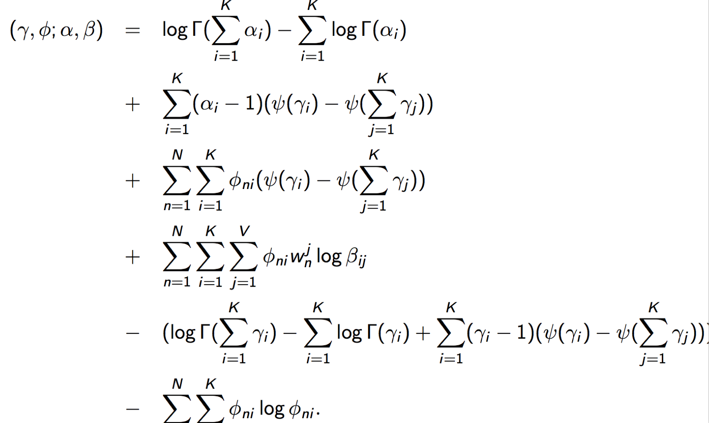
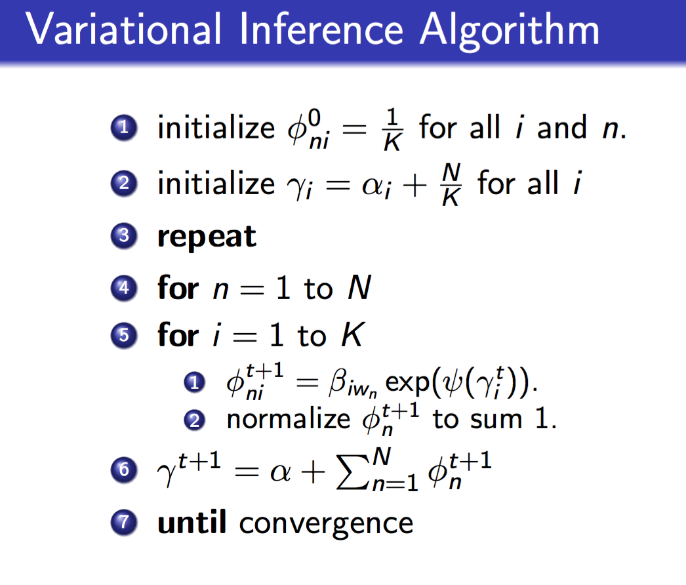
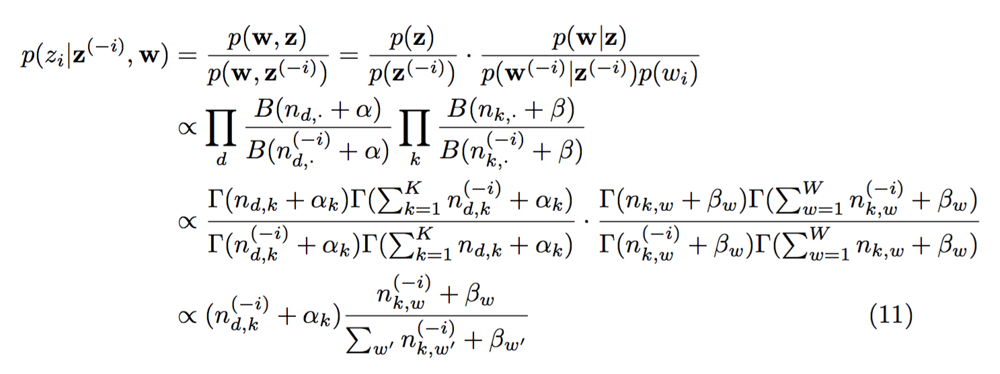
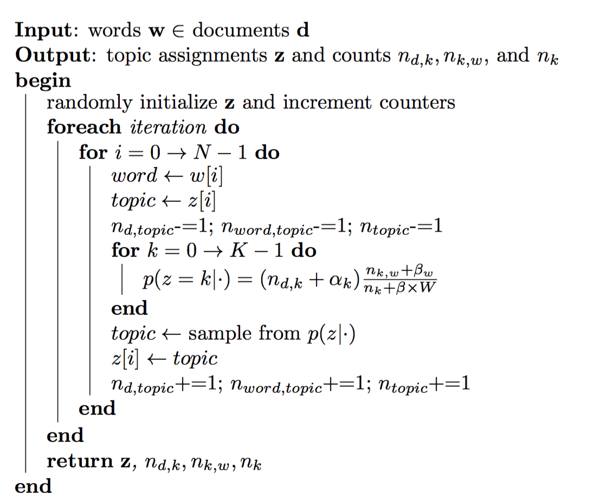

# Latent Dirichlet Allocation

## Motivation
* Add a conjugate prior to $\theta$ in pLSA, reduce the number of parameters from $MK+KV$ to $K+KV$, which is independent from the number of documents and makes the model less prone to overfitting. 
* Besides the $\beta$ matrix, in pLSA, we learn M points; but in LDA, we learn a dirichlet. So we can easily generalize the trained model to unseen documents.

## Specification
original version:

smoothed version:

Parameters for original version:
* $K$: number of topics
* $M$: number of documents
* $N_m$: length of m-th document
* $V$: size of vocabulary
* $\alpha$: Dirichlet prior
* $\beta$: $K\times V$, word distribution of topics
* $\theta$: $M\times K$, topic distribution of documents

Parameters for smoothed version:
$$
{\begin{array}{lcl}{\boldsymbol  \alpha }&\sim &{\text{A Dirichlet hyperprior, either a constant or a random variable}}\\{\boldsymbol  \beta }&\sim &{\text{A Dirichlet hyperprior, either a constant or a random variable}}\\{\boldsymbol  \theta }_{{d=1\dots M}}&\sim &\operatorname {Dirichlet}_{K}({\boldsymbol  \alpha })\\{\boldsymbol  \phi }_{{k=1\dots K}}&\sim &\operatorname {Dirichlet}_{V}({\boldsymbol  \beta })\\z_{{d=1\dots M,n=1\dots N_{d}}}&\sim &\operatorname {Categorical}_{K}({\boldsymbol  \theta }_{d})\\w_{{d=1\dots M,n=1\dots N_{d}}}&\sim &\operatorname {Categorical}_{V}({\boldsymbol  \phi }_{{z_{{dn}}}})\\\end{array}}
$$

In the orginal version,
Joint distribution:
$$
p(\theta,z,w|\alpha,\beta)=p(\theta|\alpha)\prod_{n=1}^N p(z_n|\theta)p(w_n|z_n,\beta)
$$
The marginal distribution of a document:
$$
p(w|\alpha,\beta)=\int p(\theta|\alpha)
\left(
\prod_{n=1}^N\sum_{z_n}p(z_n|\theta)p(w_n|z_n,\beta
)\right)
\mathrm{d}\theta
$$
Posterior distribution of hidden variables:
$$p(\theta,z|w,\alpha,\beta)=\frac{p(\theta,z,w|\alpha,\beta)}{p(w|\alpha,\beta)}$$
This posterior is intractable to compute, due to the coupling between $\theta$ and $\beta$.

## Variational distribution
Here we come up with a variational distribution on latent variables, which can be decomposed as:
$$
q(\theta,z|\gamma,\phi)=q(\theta,\gamma)\prod_{n=1}^Nq(z_n|\phi_n)
$$
and optimize:
$$
(\gamma^*,\phi^*)=\underset{\gamma,\phi}{\operatorname{argmin}} 
D_{\mathrm{KL}}(q(\theta,z|\gamma,\phi)\|p(\theta,z|w,\alpha,\beta))
$$
to minimize the difference between the variational distribution and the true posterior distribution.
Play with the formula above and we will get:
$$
D_{\mathrm{KL}}(q\|p)+L(\gamma,\phi;\alpha,\beta)=\log p(w|\alpha,\beta)=
\text{constant for }\gamma,\phi
$$
where
$$
L(\gamma,\phi;\alpha,\beta)=\operatorname E_q[\log p(\theta,z,w|\alpha,\beta)]
-\operatorname E_q[\log q(\theta,z)]
$$
So minimizing the KL divergence is equivalent to maximizing the function $L$ as the lower bound of $\log p(w|\alpha,\beta)$:
$$
(\gamma^*,\phi^*)=\underset{\gamma,\phi}{\operatorname{argmax}} L(\gamma,\phi;\alpha,\beta)
$$
## Parameter estimation
Variational EM algorithm:
* E-step: maximize the lower bound $L(\gamma,\phi;\alpha,\beta)$ with respect to the variational parameters $\gamma$ and $\phi$
* M-step: maximize the bound with respect to the model parameters $\alpha$ and $\beta$

### E-step: variational inference
A few more steps:
$$
\begin{align}
L(\gamma,\phi;\alpha,\beta)
&{}=\operatorname E_q[\log p(\theta,z,w|\alpha,\beta)]-\operatorname E_q[\log q(\theta,z)]\\
&{}=\operatorname E_q[\log p(\theta|\alpha)]+\operatorname E_q[p(z|\theta)]+\operatorname E_q[p(w|z,\beta)]-\operatorname E_q[\log q(\theta)]-\operatorname E_q[\log q(z)]
\end{align}
$$
Struggle through **heavy math** to compute each term and we finally get ($\psi$ is the digamma function):

Taking derivatives of this function and set derivatives to zero yields the update formulas.
The variational inference algorithm update $\gamma$ and $\phi$ alternately until convergence:

### M-step
Maximize $L(\gamma,\phi;\alpha,\beta)$ with respect to $\beta$:
$$
L_\beta=\sum_{d=1}^M\sum_{n=1}^{N_d}\sum_{i=1}^K\sum_{j=1}^V
\phi_{dni}w_{dn}^j\log\beta_{ij}+\sum_{i=1}^K\lambda_i\left(\sum_{j=1}^V\beta_{ij}-1\right)
$$
Taking the derivative with respect to $\beta_{ij}$ and setting it to zero:
$$
\beta_{ij}\propto\sum_{d=1}^M\sum_{n=1}^{N_d}\phi_{dni}w^j_{dn}
$$

Maximize $L(\gamma,\phi;\alpha,\beta)$ with respect to $\alpha$:
$$
L_\alpha=\sum_{d=1}^M\left(\log\Gamma\left(\sum_{j=1}^K\alpha_j\right)-\sum_{i=1}^K\log\Gamma(\alpha_i)\right)
+\sum_{i=1}^K\left((\alpha_i-1)\left(\psi(\gamma_{di})-\psi\left(\sum_{j=1}^K\gamma_{dj}\right)\right)\right)
$$
Taking the derivative with respect to $\alpha_i$:
$$
\frac{\partial L}{\partial \alpha_i}=M\left(\psi\left(\sum_{j=1}^K\alpha_j\right)-\psi(\alpha_i)\right)
+\sum_{d=1}^M\left(\psi(\gamma_{di})-\psi\left(\sum_{j=1}^K\gamma_{dj}\right)\right)
$$
It is difficult to compute $\alpha_i$ by setting the derivative to zero. So we compute the Hessian Matrix by: (if $i=j$ then $\delta(i,j)=1$ or 0 otherwise)
$$
\frac{\partial^2L}{\partial\alpha_i\partial\alpha_j}=
M\left(\psi'\left(\sum_{j=1}^K\alpha_j\right)
-\delta(i,j)\psi'(\alpha_i)\right)
$$
and input this Hessian Matrix and the derivative to **Newton Method** to get $\alpha$. 
## Gibbs Sampling
(for smoothed version)
Theoretical analysis:

due to conjugate prior. Note that the normalizer of the first term is omitted, because the sum is the length of each document, which is fixed, while the second denominator might change after each update.

Algorithm:

Comparisons and discussions for MCMC and Variational Bayes see [Variational Bayes](Variational%20Bayes.md).

## Extensions
### Relaxing the assumptions:
* order of words doesn't matter ("Bag of words" assumption)
* order of documents doesn't matter => time-evolving, dynamic topic model
* the number of topics is assumed known, fixed and flat => Bayesian nonparametric topic model
* topics are not correlated => correlated topic model
* ...
 
### incorporating meta-data:
authors, links, other labels(supervised)...

### other problems
model checking, visualization, data discovery...
## References
- Blei, David M. "Probabilistic topic models." Communications of the ACM 55.4 (2012): 77-84.
- "Machine Learning" Lecture 19: [http://www.umiacs.umd.edu/~jbg/teaching/CSCI_5622/](http://www.umiacs.umd.edu/~jbg/teaching/CSCI_5622/)
- "Probabilistic Models for Unsupervised Learning" Lecture 5: [http://home.cse.ust.hk/~lzhang/teach/6931a/](http://home.cse.ust.hk/~lzhang/teach/6931a/)
- Dirichlet-Multinomial Distribution: [https://en.wikipedia.org/wiki/Dirichlet-multinomial_distribution#A_combined_example:_LDA_topic_models](https://en.wikipedia.org/wiki/Dirichlet-multinomial_distribution#A_combined_example:_LDA_topic_models)
- Darling, William M. "A theoretical and practical implementation tutorial on topic modeling and gibbs sampling." Proceedings of the 49th annual meeting of the association for computational linguistics: Human language technologies. 2011.

