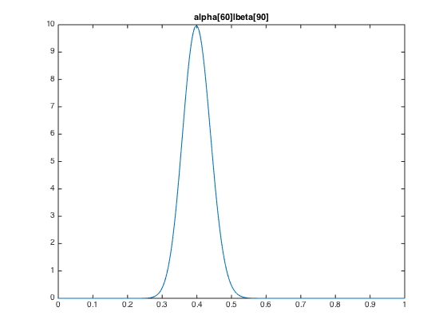

# Beta Distribution

## Characterization
PDF:
$$f(x;\alpha,\beta) = \frac{1}{\mathrm{B}(\alpha,\beta)} x^{\alpha-1}(1-x)^{\beta-1}$$
$\mathrm {B} (\alpha ,\beta )$ is called a Beta function, and is just a normalization constant.
$$\mathrm {B} (\alpha ,\beta )={\int_0^1 t^{\alpha-1} (1-t)^{\beta-1}\, dt}=
{\frac {\Gamma (\alpha )\Gamma (\beta )}{\Gamma (\alpha +\beta )}}$$
$\Gamma(x)$ is a [gamma function](Gamma%20Function.md).
Its general CDF function does not have an analytic expression.

## Applications
Beta Distribution is the [conjugate prior](Conjugate%20Prior.md) of many discrete distributions, including the Bernoulli and binomial distribution, in **Bayesian inference**.
The parameters, $\alpha$ and $\beta$, can be intuitively interpreted as positive and negative "psudo samples". The posterior hyperparameters of Bernoulli likelihood are simply $\alpha +\sum_{i=1}^{n}x_{i},\,\beta +n-\sum_{i=1}^{n}x_{i}\!$.

## Properties
### mode
> Mode, in statistics, is the value that appears most often in a set of data, corresponding to the peak in the PDF. The anti-mode is the lowest point of the probability density curve.

The mode of a Beta distributed random variable X with α, β > 1 (and anti-mode with α, β < 1), is
$$\frac{\alpha-1}{\alpha+\beta-2}$$
### mean
$$ \mu = \operatorname{E}[X]
     = \frac{\alpha}{\alpha + \beta} $$

## Reference
Beta Distribution: [https://en.wikipedia.org/wiki/Beta_distribution](https://en.wikipedia.org/wiki/Beta_distribution)

---
The followings are the illustrations of the hyperparameters.

Note that y axis stands for probability density, which can exceed 1 with no surprise (probability is the integral of probability density).
