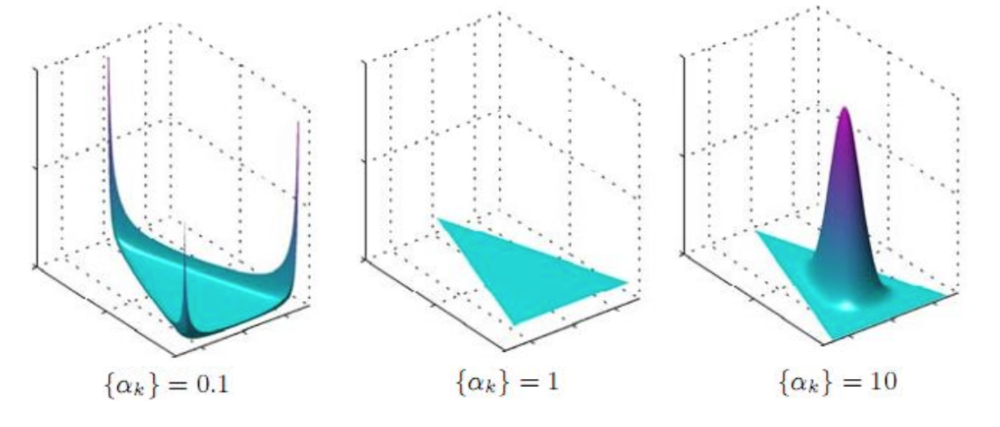

# Dirichlet Distribution

It is a multivariate generalization of the [beta distribution](Beta%20Distribution.md). A $k$-dimensional Dirichlet random variable $x$ can take values in the $(k − 1)$-simplex (a $k$-vector $x$ lies in the $(k − 1)$-simplex if $x_i \geq 0$, $\sum_{i=1}^k x_i = 1$).

PDF:
$$ f\left(x_{1},\cdots ,x_{K};\alpha_{1},\cdots ,\alpha_{K}\right)={\frac {1}{\mathrm {B} ({\boldsymbol {\alpha }})}}\prod_{i=1}^{K}x_{i}^{\alpha_{i}-1}$$

where the parameter $\boldsymbol\alpha$ is a $k$-vector with components $\alpha_i > 0$ and the **multivariate Beta function** acts as the normalizing constant:

$$\mathrm {B} ({\boldsymbol {\alpha }})={\frac {\prod _{i=1}^{K}\Gamma (\alpha _{i})}{\Gamma \left(\sum _{i=1}^{K}\alpha _{i}\right)}}$$

It's the conjugate prior of the [multinomial distribution](Multinomial%20Distribution.md).

Properties:
$$
\operatorname{E}(x_i)=\frac{\alpha_i}{\sum_{k=1}^K \alpha_k}
$$
$$
\operatorname{Var}(x_i)=
\frac{\alpha_i\left(\sum_{k=1}^K \alpha_k-\alpha_i\right)}
{\left(\sum_{k=1}^K \alpha_k\right)^2\left(\sum_{k=1}^K \alpha_k+1\right)}
$$

In **symmetric Dirichlet distribution** (where all of the elements making up the parameter vector ${\boldsymbol {\alpha }}$ have the same value):

General examples:

### Reference
Dirichlet distribution: [https://en.wikipedia.org/wiki/Dirichlet_distribution](https://en.wikipedia.org/wiki/Dirichlet_distribution)
Nonparametric Baysian Models: [http://videolectures.net/mlss09uk_teh_nbm/](http://videolectures.net/mlss09uk_teh_nbm/)
Blei, David M., Andrew Y. Ng, and Michael I. Jordan. "Latent dirichlet allocation." Journal of machine Learning research 3.Jan (2003): 993-1022.
