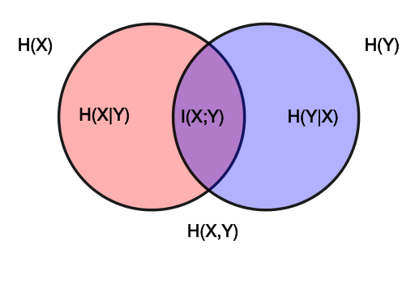

# Mutual Information

Measuring [entropy](Entropy.md) reduction: How much reduction in the entropy of X can we obtain by knowing Y?
$$
I(X; Y)= H(X) – H(X|Y) = H(Y)-H(Y|X) = H(X) + H(Y) - H(X,Y)
$$

Properties
* symmetric
* non-negative
* I(X;Y)=0 iff X and Y are independent

Formally:
$$
{\displaystyle I(X;Y)=\int_{Y}\int_{X}p(x,y)\log {\left({\frac {p(x,y)}{p(x)\,p(y)}}\right)} \mathrm dx\, \mathrm dy}
$$

Expressed by [KL Divergence](../machine%20learning/KL%20Divergence.md):
$$I(X;Y)=D_{\mathrm {KL} }(p(x,y)\|p(x)p(y))$$
MI measures the divergence of the actual joint distribution from the expected distribution under the independence assumption.

Furthermore,
$$
{\begin{align*}
I(X;Y)
&{}=D_{\mathrm {KL} }(p(x,y)\|p(x)p(y))\\\\
&{}=\int p(x,y)\log\frac{p(x,y)}{p(x)p(y)} \mathrm dx \mathrm dy\\\\
&{}=\int p(x|y)p(y)\log\frac{p(x|y)}{p(x)} \mathrm dx \mathrm dy\\\\
&{}=\int p(y)\left(\int p(x|y)\log \frac{p(x|y)}{p(x)}\mathrm dx\right)\mathrm dy\\\\
&{}=\operatorname {E}\_{Y}\{D_{\mathrm {KL} }(p(x|y)\|p(x))\}
\end{aligned}}
$$
Thus, MI can also be understood as the expectation of the Kullback–Leibler divergence of the univariate distribution p(x) of X from the conditional distribution p(x|y) of X given Y: the more different the distributions p(x|y) and p(x) are on average, the greater the information gain.

### Reference
- Mutual Information: [https://en.wikipedia.org/wiki/Mutual_information](https://en.wikipedia.org/wiki/Mutual_information)
- Text Mining: [https://www.coursera.org/learn/text-mining](https://www.coursera.org/learn/text-mining)
